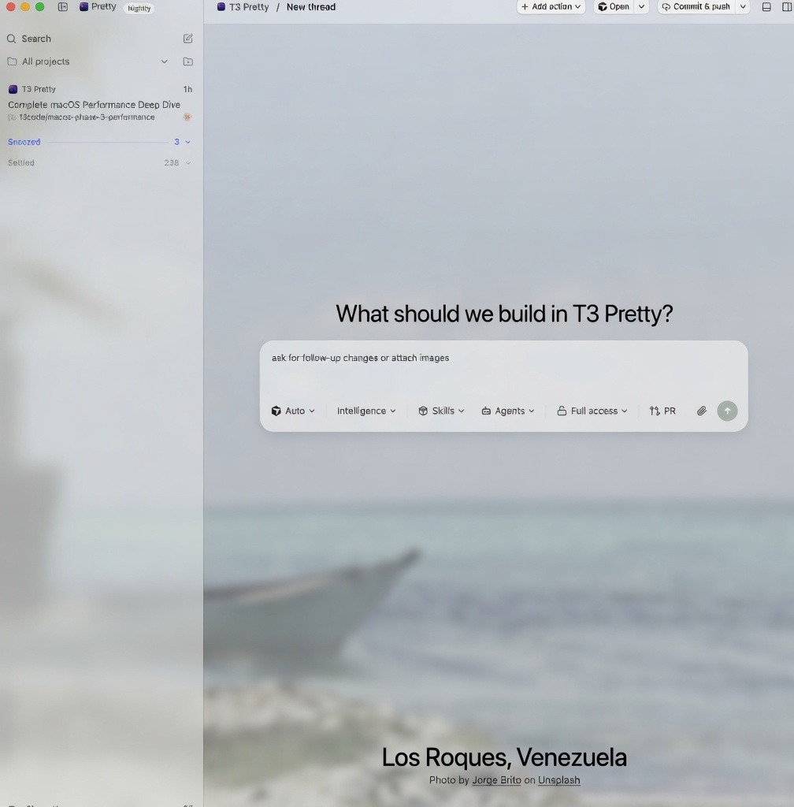

<p align="center">
  
</p>

<h1 align="center">T3 Pretty</h1>

<p align="center">
  <strong>All the agents. A landscape instead of a blank canvas.</strong>
</p>

<p align="center">
  🌄 World Scenery &nbsp;·&nbsp; 🪟 Frosted glass &nbsp;·&nbsp; 🖥️ Desktop &nbsp;·&nbsp; 🌐 Web &nbsp;·&nbsp; 📱 Mobile &nbsp;·&nbsp; MIT
</p>

<p align="center">
  A personal, style-focused fork of
  <a href="https://github.com/pingdotgg/t3code">T3 Code</a>.
  Same harness. Same subscriptions. Dressed for long sessions.
</p>

<p align="center">
  <a href="https://cursor.com/codebase/serbinenko/t3-pretty/releases/latest"><strong>⬇ Latest release</strong></a>
  &nbsp;·&nbsp;
  <a href="https://pub-8033bcab5baf492b81c605581ff028e0.r2.dev/t3-pretty/latest/T3-Code-0.0.34-nightly.20260819.1133000284-arm64.dmg">macOS</a>
  &nbsp;·&nbsp;
  <a href="https://pub-8033bcab5baf492b81c605581ff028e0.r2.dev/t3-pretty/latest/T3-Code-0.0.34-nightly.20260819.1133000284-x64.exe">Windows</a>
  &nbsp;·&nbsp;
  <a href="https://cursor.com/codebase/serbinenko/t3-pretty/releases">All releases</a>
</p>

<p align="center">
  
</p>

T3 Pretty is an **agent harness control surface**. It runs the coding-agent CLIs already on your
machine and gives you one place to steer them — from a desktop window, a browser, or a phone.

It keeps T3 Code's workflow, providers, remote access, and data paths. The fork's job is the
look: **World Scenery** puts a real landscape behind frosted chrome, so the app reads as a place
rather than a flat panel. Internal package names, protocols, and `~/.t3` stay stable on purpose.
Visual changes are not allowed to trade away capability or existing state.

> [!IMPORTANT]
> `npx t3@latest`, Homebrew `t3-code`, and winget `T3Tools.T3Code` install **upstream T3 Code**,
> not this fork. T3 Pretty is this repository. Grab a desktop build from
> [Latest release](https://cursor.com/codebase/serbinenko/t3-pretty/releases/latest), or run from
> source (below).

---

## Why it's Pretty 🌄

World Scenery is T3 Pretty's default theme. Light, dark, or system — the palette is alpine moss and
sage. Chrome is glass over a photo, not a solid slab. **Settings → Appearance → Personalization**
has **Boring** for people who want the original T3 Chat colors and no landscape photos.

|                            | What you get                                                                                     |
| -------------------------- | ------------------------------------------------------------------------------------------------ |
| 🗺️ **A place per thread**  | Each conversation keeps its own landscape. Home uses the photo of the day.                       |
| 🌫️ **Fog on a new thread** | A cloud bank gathers, the place name rises, the composer comes up through it.                    |
| 🪟 **Shared glass**        | Left sidebar, right sidebar, composer, and terminal share one frosted plate.                     |
| 🎚️ **Your density**        | Photo blur, photo presence, glass opacity, scenery text color, thread motion, fonts.             |
| 🧘 **Still when you want** | Thread motion off, or the system reduce-motion setting, parks fades and keeps status dots still. |

Open **Settings → Appearance**. On a phone, Personalization and **Scenery photos** live in the
same Appearance screen.

The product should feel calm during a long day, candid about what is running, and confident
without becoming ornamental. Motion is a fade or a press — not a GPU hobby.

---

## Surfaces ✨

| Surface        | What you get                                                                                                     |
| -------------- | ---------------------------------------------------------------------------------------------------------------- |
| 🖥️ **Desktop** | Electron app, product name **T3 Pretty (Alpha)**. Hosts the local server so a phone or another machine can join. |
| 🌐 **Web**     | The same UI, served by the local server. Pair a browser with the printed pairing URL.                            |
| 📱 **Mobile**  | React Native for iOS and Android. Build from source — it is not on the App Store or Play Store yet.              |

Remote is a first-class path: pair over your tailnet, scan the QR from a running server, or use
**Surge Connect** (this fork's account mesh) so every signed-in device sees the same environments.

---

## Bring your own subscriptions 🔌

T3 Pretty does not sell models. It drives provider CLIs you already installed and logged into.

| Provider       | CLI                                                                                          | Login               | Default |
| -------------- | -------------------------------------------------------------------------------------------- | ------------------- | ------- |
| **Codex**      | [Codex CLI](https://developers.openai.com/codex/cli)                                         | `codex login`       | On      |
| **Claude**     | [Claude Code](https://claude.com/product/claude-code)                                        | `claude auth login` | On      |
| **Kimi Code**  | [Kimi Code CLI](https://www.kimi.com/code/docs/en/kimi-code-cli/guides/getting-started.html) | `kimi login`        | On      |
| **Cursor**     | [Cursor CLI](https://cursor.com/cli) (`cursor-agent`)                                        | `agent login`       | Off     |
| **Grok Build** | [Grok Build CLI](https://x.ai/cli)                                                           | `grok login`        | Off     |

Install and authenticate at least one provider on the machine that runs the server. Cursor is the
one to watch: the binary is `cursor-agent`, the login command is `agent login`.

You can hand a thread to another provider mid-conversation, attach MCP **Apps**, load **Skills**,
and let the agent open a pull request when it finishes.

---

## What still works (on purpose) 🛠️

Everything you would expect from T3 Code is still here:

- Permission modes (Supervised, Auto-accept edits, Auto, Full access — Kimi offers Supervised / Yolo / Full access, defaulting to Yolo)
- Worktrees, checkpoints, diffs, and a Ghostty-backed terminal
- Source control for GitHub, GitLab, Bitbucket, Azure DevOps, and [Origin](https://origin.cursor.com)
- Automatic pull requests, usage, storage cleanup, project icons
- Command palette, custom keybindings, subagents

The fork syncs upstream T3 Code nightlies on a four-hour cadence and keeps Pretty-specific
behavior at conflict boundaries. See [docs/operations/fork-release.md](./docs/operations/fork-release.md).

---

## Download 📦

Every merge to `main` publishes a desktop build. **[Latest release](https://cursor.com/codebase/serbinenko/t3-pretty/releases/latest)** always points at the current Origin tag. **[All releases](https://cursor.com/codebase/serbinenko/t3-pretty/releases)** lists the rest.

| Platform                     | Installer                                                                                                                                     |
| ---------------------------- | --------------------------------------------------------------------------------------------------------------------------------------------- |
| 🍎 **macOS** (Apple Silicon) | [DMG](https://pub-8033bcab5baf492b81c605581ff028e0.r2.dev/t3-pretty/latest/T3-Code-0.0.34-nightly.20260819.1133000284-arm64.dmg)              |
| 🪟 **Windows** (x64)         | [NSIS](https://pub-8033bcab5baf492b81c605581ff028e0.r2.dev/t3-pretty/latest/T3-Code-0.0.34-nightly.20260819.1133000284-x64.exe)               |
| 🐧 **Linux** (x64)           | [AppImage](https://pub-8033bcab5baf492b81c605581ff028e0.r2.dev/t3-pretty/latest/T3-Code-0.0.34-nightly.20260819.1133000284-x64.AppImage)      |
| 📋 **Release notes**         | [Latest](https://cursor.com/codebase/serbinenko/t3-pretty/releases/latest) · [All](https://cursor.com/codebase/serbinenko/t3-pretty/releases) |

The installer filenames still say `T3-Code-…` on purpose: internal package names stay compatible with T3 Code. The app you launch is **T3 Pretty (Alpha)**. After the first install, the desktop app updates itself from the same public feed.

The feed always lists whatever is current: [macOS manifest](https://pub-8033bcab5baf492b81c605581ff028e0.r2.dev/t3-pretty/latest/latest-mac.yml) · [Windows manifest](https://pub-8033bcab5baf492b81c605581ff028e0.r2.dev/t3-pretty/latest/latest.yml) · [Linux manifest](https://pub-8033bcab5baf492b81c605581ff028e0.r2.dev/t3-pretty/latest/latest-linux.yml). Mobile is source-only for now: [apps/mobile/README.md](./apps/mobile/README.md).

---

## Run from source 🚀

Prefer a local checkout, or want to hack on the look? This is the source path.

**Needs:** Node **24** (`^24.13.1`) and [Vite+](https://viteplus.dev/guide/) (`vp`).

### 1. Clone from Origin

This fork lives on Cursor Origin. GitHub is not the source of truth.

```bash
git clone https://origin.cursor.com/serbinenko/t3-pretty.git
cd t3-pretty
```

### 2. Install `vp`

macOS / Linux:

```bash
curl -fsSL https://vite.plus | bash
```

Windows:

```powershell
irm https://vite.plus/ps1 | iex
```

### 3. Install and start

```bash
vp i
vp run dev
```

`vp run dev` starts the server and web app, then prints a **pairing URL**. Open that full URL
(token included) in the browser. A URL without its token will not let you in. If the token was
already used, mint a fresh one with `node apps/server/src/bin.ts pair`.

Useful variants:

```bash
vp run dev --share      # publish over your tailnet (HTTPS)
vp run dev:desktop      # Electron shell against the dev server
vp run dev --help
```

### 4. Desktop installers (optional)

```bash
vp run dist:desktop:dmg        # macOS
vp run dist:desktop:win        # Windows NSIS
vp run dist:desktop:linux      # Linux AppImage
```

Artifacts land in `./release`. Local DMGs are unsigned unless you set signing credentials.

Mobile builds: [apps/mobile/README.md](./apps/mobile/README.md).

---

## Docs 📚

Full docs live in [docs/](./docs). There is no separate docs site.

**Using the app**

- [World Scenery](./docs/user/world-scenery.md)
- [Install and first run](./docs/user/install.md)
- [Permission modes](./docs/user/permission-modes.md)
- [Keyboard shortcuts](./docs/user/keybindings.md)
- [Message composer](./docs/user/composer.md)
- [Organizing threads](./docs/user/thread-sidebar.md)
- [Skills](./docs/user/skills.md) · [Apps](./docs/user/apps.md) · [Subagents](./docs/user/subagents.md)
- [Remote access](./docs/user/remote-access.md) · [Surge Connect](./docs/user/remote-access.md#surge-connect)
- [Source control](./docs/user/source-control.md) · [Automatic pull requests](./docs/user/auto-pull-requests.md)
- [Provider handoff](./docs/user/provider-handoff.md)
- [Usage](./docs/user/usage.md) · [Storage](./docs/user/storage.md)
- [Project icons](./docs/user/project-settings.md) · [Mobile appearance](./docs/user/mobile-appearance.md)
- [Keeping client and server in sync](./docs/user/updating.md)
- [Background service](./docs/user/background-service.md) (Linux and macOS)
- Providers: [Codex](./docs/user/providers-codex.md) · [Claude](./docs/user/providers-claude.md) · [Kimi](./docs/user/providers-kimi.md)

**Working on the fork**

- [Architecture overview](./docs/internals/overview.md)
- [Workspace layout](./docs/internals/workspace-layout.md)
- [Contributing](./CONTRIBUTING.md) · [AGENTS.md](./AGENTS.md)
- [Parent sync and desktop releases](./docs/operations/fork-release.md)

---

## This is a fork 🌿

|              | Upstream T3 Code                                                   | T3 Pretty                                     |
| ------------ | ------------------------------------------------------------------ | --------------------------------------------- |
| Home         | [github.com/pingdotgg/t3code](https://github.com/pingdotgg/t3code) | Cursor Origin `serbinenko/t3-pretty`          |
| Look         | Stock T3 chrome                                                    | World Scenery + Pretty icon                   |
| Connect mesh | T3 Connect                                                         | **Surge Connect** (same protocol, fork relay) |
| Desktop      | `T3 Code`                                                          | `T3 Pretty (Alpha)`                           |
| Data         | `~/.t3`                                                            | `~/.t3` (same on purpose)                     |

Want the original instead? [T3 Code](https://github.com/pingdotgg/t3code) ships desktop downloads,
`npx t3@latest`, and mobile apps on [iOS](https://apps.apple.com/us/app/t3-code-remote-claude-more/id6787819824)
and [Android](https://play.google.com/store/apps/details?id=com.t3tools.t3code).

---

## Contributing 🫶

This is a personal fork. Pull requests belong on Origin, against `main`:

[https://cursor.com/codebase/serbinenko/t3-pretty](https://cursor.com/codebase/serbinenko/t3-pretty)

Keep the change small. Say exactly what changed and why. UI needs before/after images. Motion
needs a short video. Read [CONTRIBUTING.md](./CONTRIBUTING.md) first.

Do not open review PRs against GitHub. That copy is retired.

---

## License

MIT. See [LICENSE](./LICENSE).

T3 Pretty stands on [T3 Code](https://github.com/pingdotgg/t3code) by T3 Tools. Thank you for
making something worth forking.
